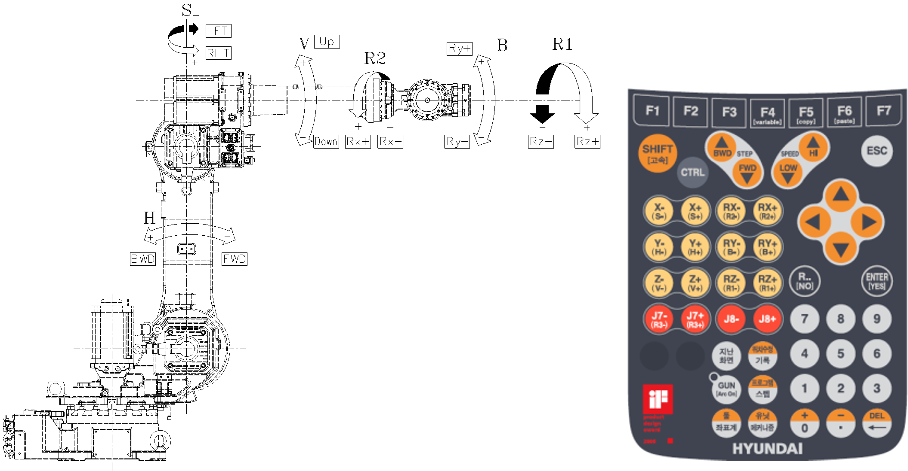

# 2.5. 동작 축 명칭

표 2-4 각 축의 회전 방향

<table class="tg">
<thead>
  <tr>
    <th class="tg-jx5t">축 명칭</th>
    <th class="tg-jx5t">동작</th>
    <th class="tg-jx5t" colspan="2">티치팬던트 버튼</th>
  </tr>
</thead>
<tbody>
  <tr>
    <td class="tg-dq1w">S</td>
    <td class="tg-ew0z">선회</td>
    <td class="tg-ew0z">좌(S+)</td>
    <td class="tg-ew0z">우(S-)</td>
  </tr>
  <tr>
    <td class="tg-dq1w">H</td>
    <td class="tg-ew0z">전후</td>
    <td class="tg-ew0z">후(H+)</td>
    <td class="tg-ew0z">전(H-)</td>
  </tr>
  <tr>
    <td class="tg-dq1w">V</td>
    <td class="tg-ew0z">상하</td>
    <td class="tg-ew0z">상(V+)</td>
    <td class="tg-ew0z">하(V-)</td>
  </tr>
  <tr>
    <td class="tg-dq1w">R2</td>
    <td class="tg-ew0z">회전 2</td>
    <td class="tg-ew0z">정(R2+)</td>
    <td class="tg-ew0z">역(R2-)</td>
  </tr>
  <tr>
    <td class="tg-dq1w">B</td>
    <td class="tg-ew0z">구부림</td>
    <td class="tg-ew0z">정(B+)</td>
    <td class="tg-ew0z">역(B-)</td>
  </tr>
  <tr>
    <td class="tg-dq1w">R1</td>
    <td class="tg-ew0z">회전 1</td>
    <td class="tg-ew0z">정(R1+)</td>
    <td class="tg-ew0z">역(R1-)</td>
  </tr>
</tbody>
</table>
  

그림 2.8 본체 외관 및 동작 축 [YS080/YS100A/HH050/HH030L]- [HH050T] R2축 제외